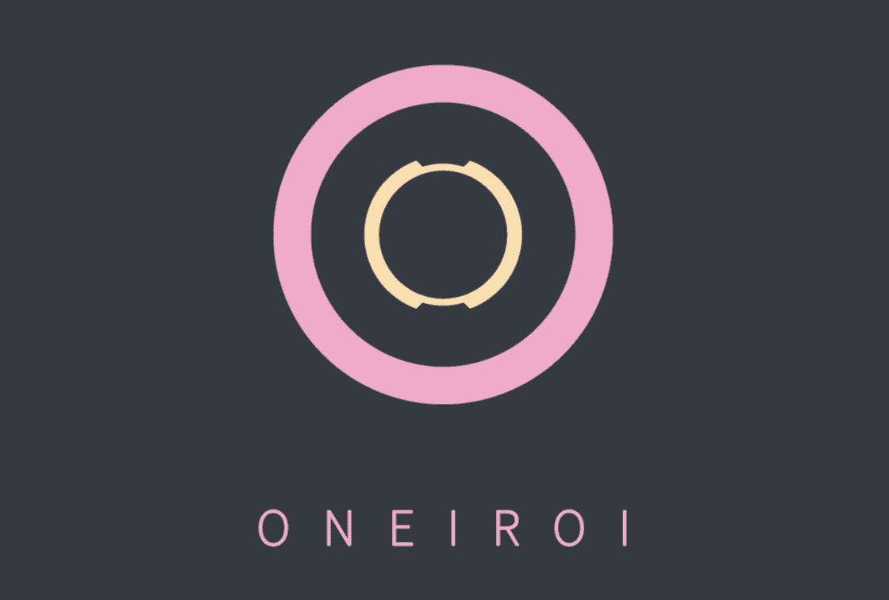

# Oneiroi theme for [Wezterm](https://wezfurlong.org/wezterm/)

> A fantastic theme for `Wezterm`.  

<p align="center">
  
</p>

## Themes available

- oneiroi dream

<p align="center">
  
</p>

- oneiroi melatonin

<p align="center">
  
</p>

## Installation

Compile and install:

1. Clone this repository

    ```bash
    git clone "https://github.com/OneiroiTheme/wezterm.git" ./wezterm
    cd ./vscode
    ```

2. Set `color_scheme_dirs` in your `wezterm.lua`

    Refer to [this](https://wezfurlong.org/wezterm/config/appearance.html#defining-a-color-scheme-in-a-separate-file) official configuration

3. Set `color_scheme` to your preferred flavor (e.g. `oneiroi dream`).

    ```lua
    color_scheme = "oneiroi dream",
    ```

Hello fantasy world!🎉
